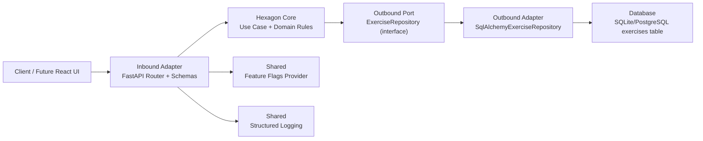
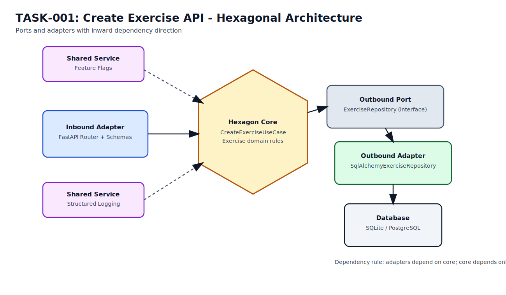

# TASK-001 - Create Exercise API (`POST /api/v1/exercises`)

## Objective

Implement the first production-ready vertical slice for exercises: create a new exercise via API so it can be reused in training sessions.

## User Story

As the coach, I want to create exercises with description and tags so I can build and reuse a training exercise catalog.

## Scope

In scope:
- `POST /api/v1/exercises` endpoint
- Request validation
- Persistence to database
- Structured success/failure logging
- Feature flag guard for incomplete rollout safety
- TDD coverage across domain/application/API/integration levels

Out of scope:
- Exercise listing, update, delete
- Training session APIs
- Authentication/authorization
- Dashboard endpoint

## API Contract

### Endpoint
- Method: `POST`
- Path: `/api/v1/exercises`

### Request Body
```json
{
  "name": "Serve receive drill",
  "description": "3-pass serve receive rotation",
  "tags": ["serve-receive", "team"]
}
```

### Validation Rules
1. `name` is required, trimmed, 1..120 chars.
2. `description` is optional, max 2000 chars.
3. `tags` is optional:
   - array of strings
   - each tag trimmed, 1..40 chars
   - tags unique case-insensitive

### Success Response
- Status: `201 Created`
```json
{
  "id": "uuid",
  "name": "Serve receive drill",
  "description": "3-pass serve receive rotation",
  "tags": ["serve-receive", "team"],
  "is_active": true,
  "created_at": "2026-02-18T18:00:00Z",
  "updated_at": "2026-02-18T18:00:00Z"
}
```

### Error Responses
1. `422 Unprocessable Entity` for schema/validation issues.
2. `409 Conflict` when exercise name already exists (if uniqueness enforced in this slice).
3. `500 Internal Server Error` for unexpected failures.

## Architecture Requirements

Use Hexagonal Architecture (Ports and Adapters):

1. Core (inside hexagon):
   - Domain + application use-case (`create_exercise`) contain business logic.
2. Inbound adapter:
   - FastAPI router translates HTTP input/output to use-case calls.
3. Outbound port:
   - `ExerciseRepository` interface defines required persistence behavior.
4. Outbound adapter:
   - SQLAlchemy repository implements the port and persists data.
5. Rule:
   - Dependencies point inward; core does not import FastAPI/SQLAlchemy.

## Hexagonal Relationship Diagram



Static image version:
- `docs/assets/task-001-hexagonal-architecture.svg`



## Feature Flag

- Flag key: `exercise_create_api_enabled`
- Default: `true`
- Disabled behavior: return `404 Not Found` (hide unfinished feature semantics).
- Tests must verify both enabled and disabled behavior.

## Observability Requirements

On successful create:
- log event `exercise_created`
- include `request_id`, `exercise_id`, `route`, `latency_ms`

On failures:
- log stable error event name
- include `request_id` and structured error metadata (no stack traces in normal validation errors)

## TDD Execution Plan

Follow Red-Green-Refactor:

1. API test: valid request returns `201` and expected response fields.
2. API test: invalid payload returns `422`.
3. Domain unit tests: name/tag constraints.
4. Application unit test: use-case saves and returns created exercise.
5. Integration test: repository persists to DB and can be retrieved.
6. API test: duplicate name behavior (`409`) if uniqueness is enabled now.
7. API test: feature flag disabled returns `404`.

## Task Breakdown

1. Add API request/response schemas for exercise creation.
2. Add domain model + validation helpers for exercise creation.
3. Add repository interface and implementation.
4. Add create exercise use-case.
5. Wire dependency injection in API router.
6. Add feature flag check for endpoint/use-case access.
7. Add structured logging for create success/failure.
8. Add and pass all tests.
9. Update OpenAPI docs and README endpoint list if needed.

## Acceptance Criteria

1. `POST /api/v1/exercises` implemented and returns `201` on valid payload.
2. Validation errors return `422` with clear schema details.
3. Duplicate name returns `409` (if uniqueness enabled in this slice).
4. Data is persisted in DB with timestamps and active status.
5. Feature flag controls endpoint availability (`404` when disabled).
6. Structured logs are emitted for both success and failure paths.
7. All tests pass and `make check` succeeds.
8. Code follows clean architecture boundaries and TDD workflow.

## Definition of Done

1. Implementation complete with passing tests.
2. Lint/type-check/test pipeline green.
3. No TODO placeholders in production path.
4. Commit is production-ready for trunk-based development.
